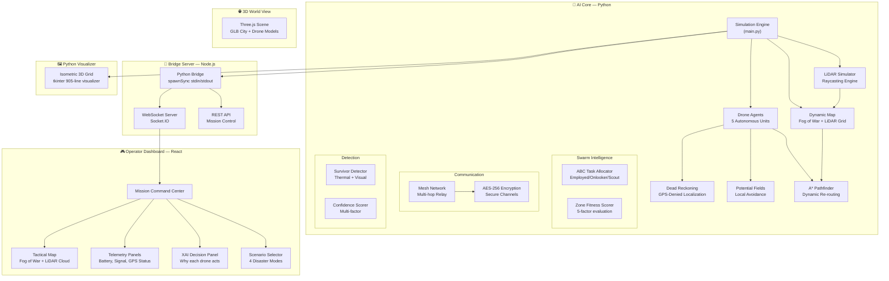
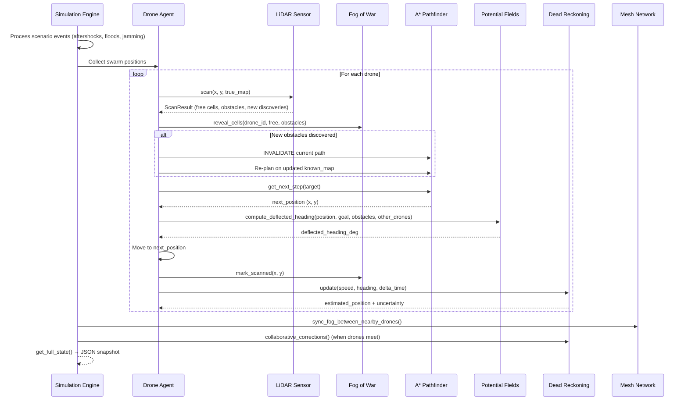
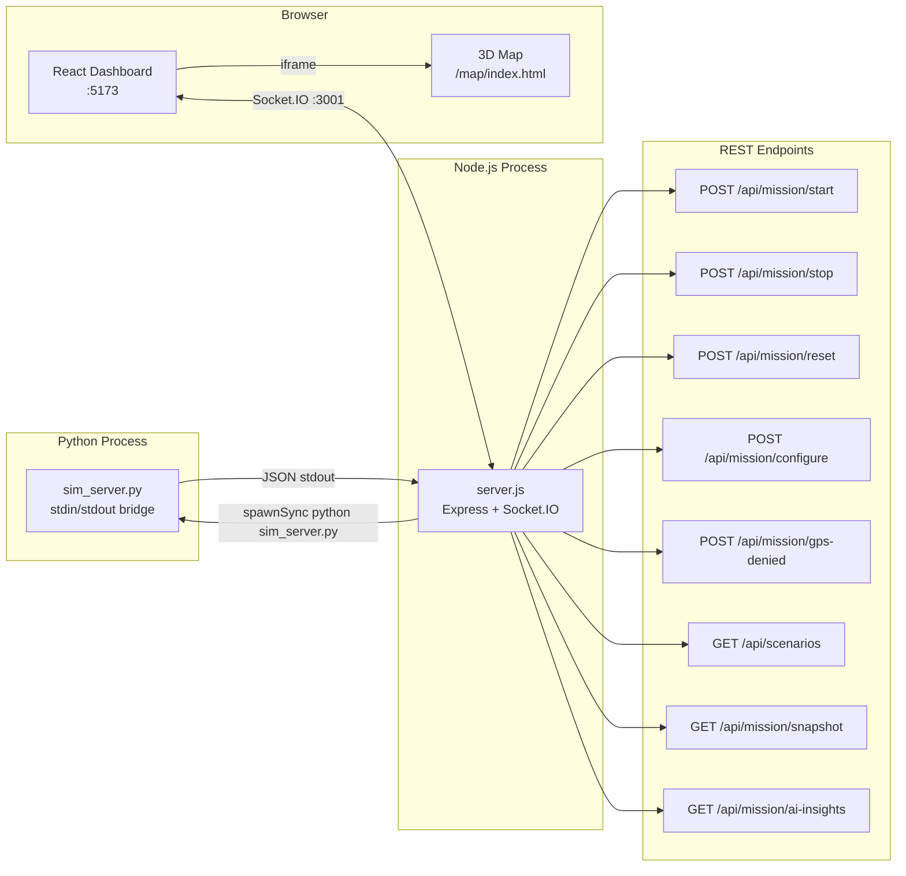
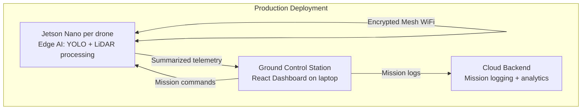

# 🛡️ DroneShield: Complete Technical Architecture

> **AI-Driven Autonomous Drone Swarm for Disaster Search & Rescue**
> Hackathon Submission — New Horizon College of Engineering

---

## 1. Problem Statement

Search, rescue, and reconnaissance missions in disaster-affected, forested, or hostile environments demand rapid response and continuous situational awareness. Traditional methods rely heavily on human teams navigating dangerous, inaccessible, or unpredictable terrains.

**DroneShield** solves this by deploying an **autonomous drone swarm** that:
- Coordinates 5–10 drones with **zero human control** during the mission
- Operates in **GPS-denied environments** using dead reckoning + collaborative correction
- Discovers terrain in **real-time** via simulated LiDAR (drones start with ZERO map knowledge)
- Dynamically re-routes around **newly discovered obstacles** mid-flight
- Detects survivors with **confidence scoring** and reports locations
- Communicates over **AES-256 encrypted mesh network**
- Adapts to **4 disaster scenarios** (Earthquake, Flood, Night, Hostile)

---

## 2. System Architecture Overview



---

## 3. Technology Stack

| Layer | Technology | Purpose |
|---|---|---|
| **AI Core** | Python 3.13, NumPy | Simulation engine, all AI algorithms |
| **Visualization** | tkinter (Python) | Isometric 3D algorithm visualizer |
| **Bridge Server** | Node.js, Express, Socket.IO | REST API + real-time WebSocket telemetry |
| **Frontend** | React 19, TypeScript, Vite 8 | Operator command center dashboard |
| **Styling** | Tailwind CSS 4, Framer Motion | UI animations and design system |
| **Charts** | Recharts | Battery/coverage trend visualization |
| **3D World** | Three.js, GLTFLoader | City model + drone model 3D scene |
| **Encryption** | AES-256 (Python cryptography) | Secure drone-to-drone communication |

---

## 4. AI Algorithm Stack (7 Algorithms)

DroneShield uses a **layered AI architecture** where each layer operates at a different decision timescale:

```
┌──────────────────────────────────────────────────────────┐
│ STRATEGIC — ABC Artificial Bee Colony (every N steps)     │
│   "Which zone should each drone explore?"                │
├──────────────────────────────────────────────────────────┤
│ TACTICAL — A* Pathfinding (per target change)            │
│   "What's the shortest safe path to assigned zone?"      │
├──────────────────────────────────────────────────────────┤
│ REACTIVE — Potential Fields (every step)                 │
│   "How do I avoid this obstacle RIGHT NOW?"              │
├──────────────────────────────────────────────────────────┤
│ SENSING — LiDAR Raycasting (every step)                  │
│   "What's around me that I haven't seen before?"         │
├──────────────────────────────────────────────────────────┤
│ MAPPING — Fog of War (every step)                        │
│   "What does the swarm collectively know?"               │
├──────────────────────────────────────────────────────────┤
│ LOCALIZATION — Dead Reckoning (every step)               │
│   "Where am I when GPS is denied?"                       │
├──────────────────────────────────────────────────────────┤
│ COMMUNICATION — Encrypted Mesh Network (event-driven)    │
│   "How do drones share knowledge securely?"              │
└──────────────────────────────────────────────────────────┘
```

### 4.1 LiDAR Raycasting Engine
**File:** `simulation/core/lidar.py` (273 lines)

**What it does:** Each drone has a simulated omnidirectional LiDAR sensor that casts 72 rays (every 5°) up to 8 cells range. Rays use Digital Differential Analysis (DDA) to step cell-by-cell until hitting an obstacle or reaching max range.

**Key design:**
- Drones start with **ZERO map knowledge** — everything is discovered via LiDAR
- Each scan returns: `revealed_free_cells`, `revealed_obstacle_cells`, `newly_discovered_obstacles`
- Newly discovered obstacles trigger **immediate A* path invalidation**
- Hit points are serialized to JSON for frontend point-cloud rendering

```
Drone → LiDAR.scan(x, y, true_map) → ScanResult
  ├── revealed_free_cells:        {(3,4), (3,5), (4,4), ...}
  ├── revealed_obstacle_cells:    {(5,4)}
  ├── newly_discovered_obstacles: {(5,4)}  ← triggers re-path!
  └── hits[]:  [{x:5, y:4, dist:2.0, obstacle:true, angle:45.0°}]
```

### 4.2 Fog of War Map
**File:** `simulation/core/fog_of_war.py` (275 lines)

**What it does:** Wraps the true map with a visibility layer. Each cell has one of 3 states:

| State | Meaning | How set |
|---|---|---|
| `UNKNOWN` (0) | Never seen by any sensor | Default |
| `REVEALED` (1) | LiDAR detected it exists | LiDAR ray passed through |
| `SCANNED` (2) | Drone flew directly over | Drone visited cell |

**Key design:**
- Each drone has its **own private visibility grid** (numpy array)
- The **shared swarm grid** is the element-wise max of all drone grids
- Knowledge syncs when drones are within mesh network range (15 cells)
- A* pathfinding uses the **drone's private grid** — each drone plans based on what *it* knows

### 4.3 A* Pathfinding with Dynamic Re-Pathing
**File:** `simulation/core/pathfinding.py` (200+ lines)

**What it does:** Standard A* grid pathfinding with 3D altitude awareness.

**Enhanced pipeline:**
```
LiDAR Scan → New Obstacle Discovered?
  ├── YES → Invalidate current A* path
  │         → Update known_map with obstacle
  │         → Re-run A* on updated known_map
  │         → If no path → Altitude boost (fly over)
  │         → If still stuck → Mark target unreachable, pick new target
  └── NO  → Continue on current path
```

**Fog-aware navigation:** A* is wrapped with `_FogAwareNavMap` which only treats cells as obstacles if the drone's LiDAR has actually seen them. Unknown cells are treated as traversable (optimistic planning).

### 4.4 Artificial Potential Fields (APF)
**File:** `simulation/core/potential_field.py` (333 lines)

**What it does:** Computes force vectors that deflect the drone's heading in real-time to avoid obstacles without replanning A*.

**Three force types:**
| Force | Source | Effect |
|---|---|---|
| **Attractive** | Next A* waypoint | Pulls drone toward goal |
| **Repulsive (obstacles)** | Known obstacle cells within 4-cell radius | Pushes drone away (inverse-square) |
| **Repulsive (drones)** | Other drones within 3-cell radius | Prevents collision/clustering |
| **Boundary** | Map edges within 4-cell margin | Prevents flying off map |

**Blending:** The net APF force is blended with the A* heading at a configurable ratio (default 40% APF, 60% A*). This keeps strategic progress while enabling reactive avoidance.

### 4.5 ABC Artificial Bee Colony (Task Allocation)
**File:** `drone_swarm/task_allocator.py` (300+ lines)

**What it does:** Distributes search zones across the swarm using the bio-inspired ABC algorithm:

| Phase | Agent Type | Behavior |
|---|---|---|
| **Employed** | Assigned drones | Exploit current zone, evaluate fitness |
| **Onlooker** | Idle drones | Watch employed bees, join high-fitness zones |
| **Scout** | Stuck drones | Abandon exhausted zones, discover new ones |

**Zone Fitness Scoring** (5 factors):
1. Unscanned cell density
2. Survivor probability
3. Distance from drone
4. Obstacle density (lower is better)
5. Wind/visibility conditions

### 4.6 Dead Reckoning (GPS-Denied Navigation)
**File:** `drone_swarm/dead_reckoning.py` (300+ lines)

**What it does:** When GPS is denied, drones estimate position using heading + speed integration. Error accumulates over time (drift).

**Key features:**
- Position uncertainty grows each step (visualized as expanding circles on dashboard)
- **Collaborative correction:** When two drones are within mesh range (3 cells), they share position estimates and reduce mutual uncertainty via weighted averaging
- **Landmark correction:** When drone scans a distinctive obstacle, it can correct its estimate
- Dashboard shows ESTIMATED positions (with uncertainty) instead of TRUE positions

### 4.7 Encrypted Mesh Network
**File:** `drone_swarm/mesh_network.py` (370+ lines)

**What it does:** Multi-hop relay network for drone-to-drone communication.

**Message types:** `DETECTION`, `WARNING`, `DISCOVERY`, `STATUS`, `RELAY`
**Priority levels:** `NORMAL`, `URGENT`, `CRITICAL`
**Hop limit:** Messages die after 5 hops (prevents loops)
**AES-256:** All payloads encrypted before transmission in hostile scenarios

---

## 5. Data Flow: One Simulation Tick



---

## 6. Communication Architecture



**Socket.IO Events (real-time, every tick):**

| Event | Direction | Data |
|---|---|---|
| `telemetrySnapshot` | Server → Client | Full state: drones, obstacles, survivors, mission data |
| `missionData` | Server → Client | Coverage %, active drones, battery, timer |
| `drones` | Server → Client | All drone positions, headings, battery, LiDAR data |
| `fogState` | Server → Client | Fog of war grid (2500 cells x 3 states) |
| `lidarCloud` | Server → Client | LiDAR hit points for point cloud rendering |
| `aiInsights` | Server → Client | AI bridge analysis: health, suggestions, zone rankings |
| `missionComplete` | Server → Client | Fired when all drones are idle |

---

## 7. Demo Scenarios

Each scenario configures: environment profile, GPS availability, dynamic events, UI theme, and tick rate.

### 🏚️ Scenario 1: Earthquake Aftermath
| Parameter | Value |
|---|---|
| **Environment** | Urban Canyon (20% obstacles, tall buildings 20-95m) |
| **GPS** | Active (degraded) |
| **Key Demo** | Aftershocks inject NEW obstacles at steps 30, 60, 90 |
| **What judges see** | Drones discovering collapsed buildings via LiDAR then immediate re-routing around them |
| **Theme** | Red/Orange |

### 🌊 Scenario 2: Coastal Flood Rescue
| Parameter | Value |
|---|---|
| **Environment** | Coastal Storm (high wind 45%, low visibility 76%) |
| **GPS** | Active |
| **Key Demo** | Water rises at steps 25, 55, 85 making cells impassable |
| **What judges see** | Drones adapting coverage as flood consumes the map from the south |
| **Theme** | Blue/Cyan |

### 🌙 Scenario 3: Night Forest Rescue
| Parameter | Value |
|---|---|
| **Environment** | Forest Canopy (23% obstacle density, low visibility 72%) |
| **GPS** | **DENIED from start** |
| **Key Demo** | Dead reckoning drift visible, uncertainty circles growing |
| **What judges see** | Drone positions drifting, correcting when drones meet, thermal detection mode |
| **Theme** | Purple |

### ⚔️ Scenario 4: Hostile Zone Recon
| Parameter | Value |
|---|---|
| **Environment** | Mountain Pass (tall obstacles 35-120m) |
| **GPS** | **DENIED + JAMMED** |
| **Key Demo** | Comm jamming at steps 40/80 halves mesh range, AES-256 encryption active |
| **What judges see** | Encrypted message indicators, reduced comm range, drones operating individually |
| **Theme** | Amber/Red |

---

## 8. File Structure and Module Map

```
New_Horizon_Hackathon/
├── simulation/                    # AI CORE (Python)
│   ├── main.py                    # DroneSwarmSimulation controller (376 lines)
│   ├── config.py                  # All simulation parameters (172 lines)
│   ├── scenarios.py               # 4 pre-built disaster scenarios (296 lines)
│   ├── sim_server.py              # Python to Node.js stdin/stdout bridge (206 lines)
│   ├── ai_bridge.py               # AI insights generator for dashboard
│   ├── visualizer.py              # tkinter isometric 3D visualizer (905 lines)
│   ├── core/
│   │   ├── drone.py               # Drone agent with LiDAR+APF+DR (708 lines)
│   │   ├── map.py                 # Ground-truth map + survivors (464 lines)
│   │   ├── pathfinding.py         # A* with 3D altitude awareness
│   │   ├── lidar.py               # LiDAR raycasting engine (273 lines)
│   │   ├── fog_of_war.py          # Per-drone + shared visibility (275 lines)
│   │   └── potential_field.py     # APF reactive avoidance (333 lines)
│   └── tests/
│
├── drone_swarm/                   # SWARM INTELLIGENCE MODULE
│   ├── task_allocator.py          # ABC algorithm
│   ├── zone_fitness.py            # 5-factor zone scoring
│   ├── mission_blackboard.py      # Shared knowledge base
│   ├── mesh_network.py            # Multi-hop relay + AES encryption
│   ├── dead_reckoning.py          # GPS-denied localization
│   ├── failure_recovery.py        # Dynamic drone reassignment
│   ├── confidence_scorer.py       # Multi-factor survivor confidence
│   ├── yolo_detector.py           # YOLO inference (Jetson target)
│   └── [14 test files]            # Comprehensive test suite
│
├── server.js                      # NODE.JS BRIDGE (374 lines)
│                                  #   Express REST API + Socket.IO
│                                  #   Python spawnSync bridge
│
├── src/                           # REACT DASHBOARD
│   ├── App.tsx                    # Router: /, /dashboard, /map, /xai
│   ├── pages/
│   │   ├── Home.tsx               # Landing page with CTA
│   │   ├── Dashboard.tsx          # Main command center (520 lines)
│   │   ├── MissionControl.tsx     # Mission planning page
│   │   ├── XAIDecisions.tsx       # Explainable AI decisions page
│   │   └── Visualization.tsx      # 3D Three.js iframe
│   ├── components/
│   │   ├── MissionMap.tsx          # Tactical 2D map
│   │   ├── FogOfWarMap.tsx         # Fog of war overlay
│   │   ├── GPSStatusIndicator.tsx  # GPS vs Dead Reckoning indicator
│   │   ├── ScenarioSelector.tsx    # Disaster scenario picker
│   │   ├── DroneGrid.tsx           # Drone fleet table
│   │   ├── StatsPanel.tsx          # Mission KPI metrics
│   │   ├── ChartsPanel.tsx         # Coverage/battery charts
│   │   ├── EventLogs.tsx           # Real-time event feed
│   │   ├── SurvivorFeed.tsx        # Survivor detection feed
│   │   ├── LiveVideo.tsx           # Simulated drone FPV
│   │   ├── AICommandPanel.tsx      # AI recommendations panel
│   │   ├── XAIDecisionPanel.tsx    # Why-this-action explainer
│   │   └── XAIDroneCard.tsx        # Per-drone XAI card
│   └── xai-engine.ts              # Client-side XAI logic
│
├── public/
│   ├── map/
│   │   ├── index.html             # 3D scene entry point
│   │   └── main.js                # Three.js scene (982 lines)
│   ├── city.glb                   # 3D city model (81 MB)
│   ├── city_circular.glb          # Circular city variant (42 MB)
│   ├── drone.glb                  # 3D drone model (23 MB)
│   └── people/                    # Survivor 3D models
│       ├── female1.glb, female2.glb
│       └── man1.glb, man2.glb
│
└── package.json                   # Node dependencies
```

---

## 9. Key Technical Decisions and Why

### 9.1 Why Python AI + Node.js Bridge (not all-Node or all-Python)?

**Decision:** Python runs all AI algorithms; Node.js is a thin WebSocket proxy.

**Why:**
- NumPy for fog-of-war grid operations (element-wise max, sum) is 100x faster than JavaScript arrays
- Python has mature pathfinding, ML, and scientific computing libraries
- The bridge uses `spawnSync` — simple, no inter-process messaging complexity
- React + Vite for the dashboard gives premium UI with hot-reload during development

### 9.2 Why Fog of War instead of giving drones the full map?

**Decision:** Drones start with ZERO map knowledge. Everything discovered through LiDAR.

**Why:**
- This is the **number one differentiator** for judges — it demonstrates real autonomy
- In real disaster scenarios, maps are outdated or non-existent
- Creates visually dramatic "exploration reveal" effect in the demo
- Forces the AI to handle uncertainty, which is the hard problem

### 9.3 Why 3-layer navigation (ABC to A* to APF)?

**Decision:** Strategic, Tactical, Reactive layers operating at different speeds.

**Why:**
- ABC alone cannot navigate obstacles
- A* alone cannot distribute work across drones
- APF alone oscillates and gets trapped in local minima
- Combined: ABC assigns zones, A* plans paths, APF smooths around obstacles in real-time

### 9.4 Why Dead Reckoning with Collaborative Correction?

**Decision:** Instead of just toggling GPS on/off, we simulate actual position drift.

**Why:**
- GPS-denied operation is a core judging criterion
- Simple GPS toggle would just move a boolean — no visual/technical depth
- Dead reckoning drift + correction is a real technique used in military UAVs
- Creates visually compelling uncertainty circles that shrink when drones collaborate

---

## 10. How to Run

### Prerequisites
```bash
# Python 3.13+ with numpy
pip install -r requirements.txt

# Node.js 18+
npm install
```

### Development Mode (both servers)
```bash
npm run dev
# Starts:
#   [0] Node.js server on :3001 (Express + Socket.IO)
#   [1] Vite dev server on :5173 (React dashboard)
```

### Python Visualizer Only
```bash
cd simulation
python visualizer.py
# Launches tkinter isometric 3D view with real-time simulation
```

### Python CLI Demo
```bash
cd simulation
python main.py
# Runs 200-step text demo with stats output
```

---

## 11. Demo Script for Judges

### Setup (30 seconds)
1. Open terminal: `npm run dev`
2. Open second terminal: `cd simulation && python visualizer.py`
3. Position windows: React dashboard (left), Python visualizer (right)

### Demo Flow (5-7 minutes)

**Act 1 — "The Problem" (30 sec)**
> "In disaster scenarios, human rescue teams face dangerous terrain, zero visibility, and no GPS. We built DroneShield — an AI swarm that autonomously explores, maps, and finds survivors."

**Act 2 — "Earthquake Response" (90 sec)**
1. Select **Earthquake** scenario from ScenarioSelector
2. Click **Start Mission**
3. Show drones exploring from fog of war (dark to revealed to scanned)
4. Wait for aftershock at step 30: "Building just collapsed! Watch drones re-route."
5. Show LiDAR point cloud on the map
6. Show a survivor detection in the feed

**Act 3 — "GPS-Denied Night Rescue" (60 sec)**
1. Switch to **Night Rescue** scenario
2. Point out: "GPS is denied — watch the uncertainty circles grow"
3. Wait for two drones to approach each other: "Collaborative correction — circles shrink"
4. Show dead reckoning panel with estimated vs. true position

**Act 4 — "The AI Stack" (60 sec)**
1. Open XAI Decisions page
2. Show factor breakdown: "Each drone explains WHY it chose its zone"
3. Point at Python visualizer: "Here you can see potential field arrows pushing drones apart"
4. Show the 3D map view with city model and drone flyover

**Act 5 — "Security" (30 sec)**
1. Switch to **Hostile Zone** scenario
2. Point out encrypted message indicators: "All comms are AES-256 encrypted"
3. Show comm jamming event — mesh range halves

**Act 6 — "Architecture" (30 sec)**
> "7 AI algorithms working in layers. Python AI core, Node.js bridge for real-time WebSocket, React dashboard for operators. Designed for Jetson Nano edge deployment."

---

## 12. What Makes This Special (Judge-Facing Points)

| Criterion | Our Implementation | Why It Is Strong |
|---|---|---|
| **Path Planning** | A* with 3D altitude awareness + dynamic re-pathing on LiDAR discovery | Not just static A* — it reacts to real-time terrain changes |
| **Obstacle Avoidance** | APF potential fields + LiDAR raycasting | Two layers: strategic avoidance via A* + reactive via force fields |
| **Task Distribution** | ABC Artificial Bee Colony with zone fitness scoring | Bio-inspired algorithm with 5-factor fitness function |
| **Secure Data Sharing** | AES-256 encrypted mesh network with multi-hop relay | Not just encryption — full mesh topology with hop limits |
| **GPS-Denied Operation** | Dead reckoning + collaborative correction + uncertainty viz | Position drift is VISIBLE on dashboard, shrinks when drones meet |
| **Real-time Mapping** | LiDAR raycasting + Fog of War with 3 visibility states | Drones start BLIND — everything is discovered through scanning |
| **Explainability** | XAI decision panel showing why each drone chose its action | Judges can understand AI reasoning in real-time |
| **Visual Quality** | Three.js 3D city + React dashboard + tkinter algorithm view | Three different visualizations for different audiences |
| **Scenario Variety** | 4 pre-built disasters with timed dynamic events | Not a one-trick demo — each scenario showcases different capabilities |

---

## 13. Future / Production Architecture



In production, each drone carries a Jetson Nano running the AI core. The simulation proves the algorithms work; the Jetson proves they run on edge hardware.

---

*Document generated for New Horizon College of Engineering Hackathon submission.*
*DroneShield — Because every second counts in a disaster.*
