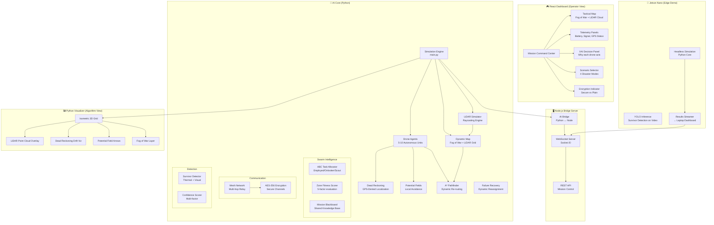

# 🏆 DroneShield Swarm: Hackathon Architecture & 2-Day Battle Plan

## Problem Statement Alignment

The hackathon demands an **AI-driven swarm control system** with:
1. ✅ **Path planning** — A* exists, needs LiDAR-driven dynamic re-pathing
2. ⚠️ **Obstacle avoidance** — Simple heading deflection exists, needs real LiDAR raycasting + potential fields
3. ✅ **Task distribution** — ABC (Artificial Bee Colony) exists, needs to be visible and wired in
4. ⚠️ **Secure data sharing** — Mesh network exists, needs AES encryption layer
5. ❌ **GPS-denied operation** — Dead reckoning module exists but ISN'T connected to simulation
6. ❌ **LiDAR simulation** — Not implemented at all
7. ❌ **Dynamic map updates** — Drones currently start with full map knowledge

---

## Current Architecture Gaps (Critical Findings)

### What Works
| Component | Status | Quality |
|---|---|---|
| Grid Map + Obstacles | ✅ Working | Good — 5 environment profiles |
| A* Pathfinding | ✅ Working | Good — 3D altitude-aware |
| Drone Movement | ✅ Working | Good — battery, wind, visibility |
| Survivor Detection | ✅ Working | Good — confidence scoring |
| React Dashboard | ✅ Working | Good — telemetry, charts, logs |
| Python tkinter Visualizer | ✅ Working | Good — isometric 3D view |
| ABC Task Allocator | ✅ Working | Moderate — not visible in demo |
| Mesh Network | ✅ Working | Module exists, not wired in |
| Dead Reckoning | ✅ Working | Module exists, not wired in |

### What's Broken / Missing
| Gap | Impact | Fix Effort |
|---|---|---|
| **LiDAR raycasting** — drones see full map from start | 🔴 Critical | 4-6 hours |
| **Fog of War** — no progressive reveal | 🔴 Critical | 2-3 hours |
| **Dynamic re-pathing** — A* doesn't react to newly discovered obstacles | 🔴 Critical | 2-3 hours |
| **GPS-denied mode** — dead reckoning not in sim loop | 🟡 High | 3-4 hours |
| **Two disconnected systems** — Node server.js sim ≠ Python simulation | 🟡 High | 3-4 hours |
| **No LiDAR point cloud viz** | 🟡 High | 3-4 hours |
| **Mesh network not wired** | 🟠 Medium | 2 hours |
| **No encrypted comms indicator** | 🟠 Medium | 1 hour |
| **Jetson Nano integration** | 🟠 Medium | 2-3 hours |
| **Demo scenarios not pre-built** | 🟡 High | 2-3 hours |

---

## Proposed Architecture



---

## Key Architecture Decisions

### 1. LiDAR Raycasting Engine (NEW)

> [!IMPORTANT]
> This is the **#1 differentiator** for the demo. Judges want to see drones discovering terrain in real-time.

**Design**: Each drone has a simulated LiDAR sensor that casts rays in 360° (configurable sectors). Rays stop at obstacles, revealing cells up to `LIDAR_RANGE` cells away.

```python
# New module: simulation/core/lidar.py
class LiDARSensor:
    def __init__(self, range_cells=8, num_rays=36, fov_degrees=360):
        self.range = range_cells
        self.num_rays = num_rays
        self.fov = fov_degrees
    
    def scan(self, drone_x, drone_y, true_map) -> ScanResult:
        """Cast rays from drone position, return discovered cells + point cloud."""
        # Returns: revealed_cells, obstacle_hits (for point cloud viz), free_cells
```

**Flow**: 
1. Drone calls `lidar.scan()` each tick
2. Newly discovered cells get added to `drone.known_map` (fog of war layer)
3. If new obstacles found → A* path is invalidated → immediate re-compute
4. Point cloud data (obstacle hit points) is sent to frontend for visualization

---

### 2. Fog of War Map Layer (NEW)

**Design**: Wrap the existing `Map` class with a `FogOfWarMap` that tracks per-cell visibility states:

| State | Meaning | Visual |
|---|---|---|
| `UNKNOWN` | Never seen by any drone | Dark/hidden |
| `REVEALED` | Seen by LiDAR but not scanned in detail | Dim/semi-transparent |
| `SCANNED` | Drone flew over and performed detailed scan | Fully visible |

Each drone has its own local knowledge. The swarm's **shared knowledge** is the union, communicated via the mesh network.

---

### 3. Dynamic Re-Pathing Pipeline (ENHANCED)

Current A* is **static** — runs once and follows the path. New pipeline:

```
LiDAR Scan → New Obstacle Discovered?
  ├── YES → Invalidate current A* path
  │         → Update known_map with obstacle
  │         → Broadcast OBSTACLE_WARNING via mesh network
  │         → Re-run A* on updated known_map
  │         → If no path → Potential Field fallback (push away from obstacle)
  │         → If still stuck → Altitude boost (fly over if possible)
  └── NO  → Continue on current path
```

---

### 4. GPS-Denied Navigation (WIRED IN)

The existing `DeadReckoningEngine` will be integrated into the simulation loop:

```
Each Tick:
  1. Drone moves by (dx, dy) in true coordinates
  2. Dead reckoning estimates position with drift noise
  3. Visual position on dashboard shows ESTIMATED position (with error circle)
  4. True position is hidden (ground truth for scoring)
  5. Collaborative correction: When 2 drones are within mesh range,
     they share positions → reduce mutual uncertainty
  6. Landmark observations: When drone scans a distinctive obstacle,
     it corrects its position estimate
```

**Dashboard indicator**: Toggle between "GPS Mode" (perfect positions) and "GPS-Denied Mode" (drifting positions with uncertainty circles).

---

### 5. Hybrid Swarm Algorithm Stack

| Layer | Algorithm | Purpose |
|---|---|---|
| **Strategic** | ABC (Artificial Bee Colony) | Zone-level task allocation across swarm |
| **Tactical** | A* Pathfinding | Grid-level path planning to target zones |
| **Reactive** | Potential Fields | Immediate obstacle avoidance + inter-drone spacing |

**Potential Fields** (NEW):
- Obstacles generate **repulsive** fields
- Unscanned zones generate **attractive** fields  
- Other drones generate **repulsive** fields (collision avoidance)
- Net force vector modifies A* path heading in real-time

---

### 6. Encrypted Mesh Communication

Add an encryption layer to the existing `MeshNetwork`:

```python
# Enhancement to mesh_network.py
class SecureMeshNetwork(MeshNetwork):
    def __init__(self, ...):
        super().__init__(...)
        self.encryption_key = os.urandom(32)  # AES-256
        self.encryption_enabled = True
    
    def send_message(self, message):
        if self.encryption_enabled:
            message.payload = self._encrypt(message.payload)
            message.encrypted = True
        return super().send_message(message)
```

**Dashboard indicator**: 🔒 icon on each message in the event log showing encrypted status.

---

### 7. Demo Scenarios (4 Pre-Built)

Each scenario configures: environment profile, GPS availability, dynamic events, and visual theme.

| Scenario | Environment | GPS | Dynamic Events | Key Demo Point |
|---|---|---|---|---|
| 🏚️ **Earthquake** | `urban_canyon` | Denied | Aftershock → new obstacles appear mid-mission | Dynamic re-pathing |
| 🌊 **Flood Rescue** | `coastal_storm` | Partial | Water rises → cells become impassable over time | Adaptive coverage |
| 🌙 **Night Rescue** | `forest_canopy` | Denied | Low visibility → thermal-only detection | Sensor fusion |
| ⚔️ **Hostile Zone** | `mountain_pass` | Denied + Jammed | Comm jamming → mesh degrades, encryption critical | Secure comms |

---

### 8. Jetson Nano Integration

**What runs on Jetson:**
1. **Headless Python Simulation** — The `DroneSwarmSimulation` runs on Jetson at full speed
2. **YOLO Inference Demo** — Run a pre-trained tiny YOLO model on sample disaster images to show "survivor detection AI"
3. **Results Stream** — WebSocket connection from Jetson → laptop dashboard, showing Jetson as an "edge compute node"

**Demo story**: "In production, each drone carries a Jetson Nano for edge AI. We're showing one Jetson running the full swarm simulation + YOLO inference to prove it handles the compute."

---

## File Changes Map

### New Files
| File | Purpose |
|---|---|
| [NEW] `simulation/core/lidar.py` | LiDAR raycasting engine |
| [NEW] `simulation/core/fog_of_war.py` | Fog of war map wrapper |
| [NEW] `simulation/core/potential_field.py` | Potential field obstacle avoidance |
| [NEW] `simulation/scenarios.py` | Pre-built demo scenario configs |
| [NEW] `simulation/jetson_runner.py` | Headless Jetson simulation runner |
| [NEW] `src/components/LiDARCloud.tsx` | LiDAR point cloud visualization |
| [NEW] `src/components/FogOfWarMap.tsx` | Fog of war tactical map |
| [NEW] `src/components/GPSStatusIndicator.tsx` | GPS vs Dead Reckoning indicator |
| [NEW] `src/components/ScenarioSelector.tsx` | Disaster scenario picker |

### Modified Files
| File | Changes |
|---|---|
| [MODIFY] `simulation/core/drone.py` | Integrate LiDAR, dead reckoning, potential fields into move loop |
| [MODIFY] `simulation/core/map.py` | Add fog-of-war state, dynamic obstacle injection |
| [MODIFY] `simulation/core/pathfinding.py` | Add dynamic re-pathing trigger + path invalidation |
| [MODIFY] `simulation/main.py` | Wire in new systems, add scenario loading |
| [MODIFY] `simulation/visualizer.py` | Add LiDAR cloud overlay, fog of war, DR drift visualization |
| [MODIFY] `simulation/config.py` | Add LiDAR, potential field, dead reckoning configs |
| [MODIFY] `drone_swarm/mesh_network.py` | Add AES encryption layer |
| [MODIFY] `server.js` | Add scenario API, fog-of-war state, LiDAR data in snapshots |
| [MODIFY] `src/pages/Dashboard.tsx` | Integrate new components, scenario selector |
| [MODIFY] `src/components/MissionMap.tsx` | Add fog of war + LiDAR cloud rendering |

---

## 2-Day Execution Plan

### Day 1 (12-14 hours) — Core Engine + Visualization

| Time Block | Task | Priority |
|---|---|---|
| **Hour 1-2** | Build `lidar.py` — raycasting engine with configurable range, ray count, FOV | 🔴 P0 |
| **Hour 2-3** | Build `fog_of_war.py` — per-cell visibility states, shared swarm knowledge | 🔴 P0 |
| **Hour 3-5** | Wire LiDAR + Fog of War into `drone.py` move loop + `map.py` | 🔴 P0 |
| **Hour 5-6** | Dynamic re-pathing — A* path invalidation on new obstacle discovery | 🔴 P0 |
| **Hour 6-7** | Build `potential_field.py` — repulsive/attractive fields for local avoidance | 🔴 P0 |
| **Hour 7-9** | Wire dead reckoning into drone move loop, add GPS toggle | 🟡 P1 |
| **Hour 9-10** | Build 4 demo scenarios (`scenarios.py`) | 🟡 P1 |
| **Hour 10-12** | Update Python visualizer — fog of war layer, LiDAR cloud overlay, DR drift circles | 🟡 P1 |
| **Hour 12-14** | Test all scenarios end-to-end in Python visualizer | 🟡 P1 |

### Day 2 (10-12 hours) — Frontend + Integration + Polish

| Time Block | Task | Priority |
|---|---|---|
| **Hour 1-3** | Update `server.js` to use Python simulation as single source of truth | 🔴 P0 |
| **Hour 3-5** | Build React components — FogOfWarMap, LiDARCloud, ScenarioSelector, GPSStatus | 🔴 P0 |
| **Hour 5-7** | Integrate all new data into Dashboard — fog of war rendering, LiDAR point cloud | 🔴 P0 |
| **Hour 7-8** | Add AES encryption to mesh network + encrypted message indicator in UI | 🟠 P2 |
| **Hour 8-9** | Jetson Nano setup — headless runner + YOLO inference demo | 🟠 P2 |
| **Hour 9-10** | End-to-end demo rehearsal — all 4 scenarios | 🔴 P0 |
| **Hour 10-12** | Polish — fix bugs, smooth animations, ensure demo flow is flawless | 🔴 P0 |

---

## Verification Plan

### Automated Tests
```bash
# Run existing test suite
cd simulation && python -m pytest tests/ -v

# Test new modules
python -m pytest -v core/test_lidar.py core/test_fog_of_war.py core/test_potential_field.py

# Run full simulation demo to verify integration
python main.py  # Should complete 1000 steps with all new systems

# Test scenarios
python -c "from scenarios import SCENARIOS; print([s['name'] for s in SCENARIOS.values()])"
```

### Manual Verification
- [ ] Run each of the 4 demo scenarios in the Python visualizer
- [ ] Verify fog of war reveals correctly as drones explore
- [ ] Verify LiDAR discovers obstacles incrementally (not pre-known)
- [ ] Verify A* re-routes when LiDAR finds a new obstacle
- [ ] Verify dead reckoning drift is visible when GPS is denied
- [ ] Verify drone positions self-correct when drones meet
- [ ] Run React dashboard with live server and verify all data flows
- [ ] Run on Jetson Nano and verify it handles the compute

---

## Open Questions

> [!IMPORTANT]
> **Scenario Timing**: For the live demo, how much time do you have per scenario? This affects how many simulation steps we run and how fast the tick rate should be. Suggest 45-60 seconds per scenario at 200ms tick rate.

> [!IMPORTANT]
> **YOLO Model**: For the Jetson YOLO demo, should I use a pre-trained YOLO-tiny model on COCO (can detect "person" class) or do you have any custom training data? Pre-trained is fastest to set up.

> [!WARNING]
> **Two Simulation Engines**: The current `server.js` has its OWN simulation logic (separate from Python). My plan is to make the Python simulation the single source of truth and have `server.js` just proxy the data. This means the Node server's built-in drone movement code gets replaced. Are you OK with this?
